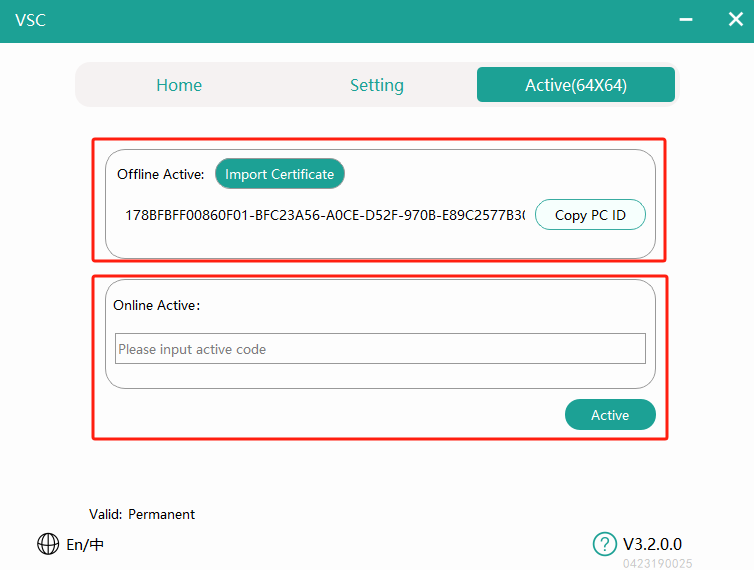

 # Digisyn Link AES67 Virtual Sound Card(VSC)

__The Digisyn Link VSC (AES67 Virtual Sound Card) can send AES67 audio streams in a Windows environment. It requires the use of the [Digisyn Link][digisyn-link] controller to manage the routing of audio streams (both unicast and multicast).__ 

The Digisyn Link VSC has currently been tested in mainstream network audio environments, including:
+ __Dante__
+ __Ravenna__
+ __Q-Lan__
+ __Telos__ 
+ __Crestron__

### Features including:
+ __•	Supports 48 kHz and 96 kHz sampling rates__
+ __•	Up to 64x64 channels__
+ __•	Windows WDM audio format__

## 1. Compatible system versions
This software requires  __Windows10__ or higher, specifically version __22H2__ and above.
The best version is __Win10 22H2__，while newer versions of __Win11__ may be less stable; __Windows11 23H2 and 24H2__ cannot guarantee stability.

## 2. Software Installation
Double-click the installer to install. You can choose the installation language (Simplified
Chinese/English).
Select the installation path and whether to create a shortcut, then continue clicking <kbd>Next</kbd>，until the installation completes.

## 3. Language Switching
Click the button in the top-left corner of the software to switch languages between Simplified Chinese and English：

## 4. Activation
Click the activation button in the top-right corner of the software to open the activation window. There are two activation methods:
1. __Offline Activation__：For devices without internet access, copy the machine ID and generate a certificate with the manufacturer for activation.
2. __Online Activation__：For devices with internet access, use the activation code.

## 5. Function Settings

After launching the software, select the corresponding wired network card <u>（___only wired network cards are supported___，wireless cards do not meet the requirements for ultra-low latency network audio transmission）.</u>

+ __Select network interface__: If there are multiple wired network cards on the host.
+ __Set the sampling rate__: (supports 48KHz and 96KHz).
+ __Set the number of channels__: within the supported range.(from 2x2 to 64x64)
+ __Click start__: and wait for the software to launch.

## 6. Create and manage unicast streams (Digisyn Link protocol)

You need to use __[Digisyn Link][digisyn-link]__  controller to create and manage audio streams. For detailed installation and usage instructions please click the link: __[Digisyn Link][digisyn-link]__ to access the Github repository.

+ __To send unicast audio streams using VSC__ click on the matrix in the Digisyn Link controller main routing interface. The left side shows sending devices, and the top shows receiving devices. Click on the sending device labeled VSC (default naming format is __vsc-xxxxx-xxxxx__  as shown in the image:
 )  
Overlap the channel you want to send from the VSC with the channel of the receiving device by clicking on the corresponding square in the matrix. When a green checkmark <kbd>√</kbd> appears, it indicates that the audio stream has been successfully created.

+ __VSC receives unicast audio stream__ currently only supports receiving sent from __[DL-04 series network modules][dl-04]__ / __[DL-08 series network modules][dl-08]__ and __[DsCore audio workstations][dscore]__. As mentioned, overlap the desired sending channel with the receiving channel on the VSC. Click on the corresponding square in the matrix, and when a green checkmark <kbd>√</kbd> appears, it indicates that the audio stream has been successfully created.

+ __To delete a unicast audio stream__ go to the matrix in the controller main routing interface. Open the channel on the VSC that you want to unsubscribe from and click on the green checkmark <kbd>√</kbd> ，When the green checkmark <kbd>√</kbd> disappears, it indicates that the audio stream subscription has been canceled.

## 7.  To create and manage AES67 Multicast Streams

+ __VSC manages AES67 group broadcast audio stream__
  + Double-click on the VSC (default naming format is __vsc-xxxxx-xxxxx__  as shown in the image: 
 )，Click on <kbd>Stream</kbd>，then select the submenu <kbd>Multicast Stream</kbd>，After filling in the details, click <kbd>Create</kbd>，The main routing matrix will display the created multicast, with the device box colored green, as shown in the image: 

  + + __Multicast Stream__：This page allows you to create, view, and delete multicast streams.
    + __Nmae of Multicast Stream__：The name displayed after creation, limited to 32 characters.
    + __Target Address__：The address for the multicast stream you can use automatic allocation or customize the address.
    + Select '__Auto__' to automatically assign the destination address and port number. The destination
address will be assigned according to the RTP prefix configured for the domain in which the device
is enrolled. For example, if the RTP prefix for the domain is 69, the device will create a flow with destination address of 239.69.x.x. The port number defaults to 5004.
    + Select '__Manual__' to specify the address and port. The IP address must be in the range __239.0.0.0__ to
__239.254.254.254__. The port can be set to any non-administrative port number.

    + __Select Channel__：The sending channels included in the multicast stream; selected channels can be sent via the multicast stream.
    + __Delete__：Click to delete an already created multicast stream on the left.

## 8. Other Settings

Click the "Settings" button in the top left corner to open the customization feature page.

## 9. Playback and Recording Channel Settings

After starting the VSC, the computer's sound playback and recording list will include the channels of the virtual sound card. 

For example, "stereo-01-02" represents stereo channels 1 and 2, corresponding to channels 1 and 2 in the routing controller.

To play or record sound, select the appropriate channel.

## 10. Troubleshooting

### 10.1  Software Window Display Too Large
This may be due to a high system scaling ratio. You can reduce the display scaling by adjusting the system resolution.

### 10.2 Software Startup Prompt: xxx.dll Library Missing
If you see a prompt about a missing DLL, it indicates that your system lacks the Microsoft runtime library. Download and install the "Microsoft VC++ Redistributable Package" to resolve this issue.

### 10.3 Software Startup Failure - Check Drivers
Ensure that the necessary drivers are correctly installed. Drivers are automatically installed during software setup, and failure to install them can lead to startup issues.  

How to Check:Right-click the <kbd>Win</kbd> icon，in the bottom left corner and select <kbd>Device Manager.</kbd>

The following image indicates that the driver is functioning normally. If a yellow exclamation mark is displayed, it suggests a driver issue. Try restarting the machine or reinstalling the software.

### 10.4 No Virtual Sound Card Option in Sound Settings

If the computer's playback and recording devices do not find the option for the virtual sound card, open the sound management page and click <kbd>open sound settings</kbd>：

Click <kbd>Recording</kbd> to check if the playback and recording pages have the virtual sound card device：

If it exists above but is disabled, right-click to enable it.

If the firewall is enabled, you need to set the following programs to allow network access:

+ ___DigisynLinkVSC_V3.0.exe___
+ ___DigisynRoute.exe___

## About this repository

1.  This repository is for storing the Digisyn Link VSC AES67 virtual sound card software package and the user manual.
2.  For more information about Digisyn Link, please visit **[www.digisynthetic.com][digisynthetic]**.
3.  This software is __Not open source__. To apply for a trial activation code or a 2x2 VSC, please send an email to **<info@digisynthetic.com>** or complete the register form at **[VSC homepage][vsc]**.

[digisyn-link]: https://www.digisynthetic.com
[dl-04]:   https://www.digisynthetic.com
[dl-08]:  https://www.digisynthetic.com
[dscore]:  https://www.digisynthetic.com
[digisynthetic]: https://www.digisynthetic.com
[vsc]: https://www.digisynthetic.com/aes67-virtual-soundcard/
